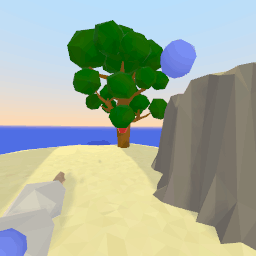

# Avalon


[](https://www.youtube.com/watch?v=4M-J11yMpD8)

## What is Avalon?

Avalon is a 3D video game environment and benchmark designed from scratch for reinforcement learning research. In Avalon, an embodied agent (human or computer) explores a procedurally generated 3D environment, attempting to solve a set of tasks that involve navigating terrain, hunting or gathering food, and avoiding hazards.

Avalon is unique among existing RL benchmarks in that the reward function, world dynamics, and action space are the same for every task, with tasks differentiated solely by altering the environment: its 20 tasks, ranging in complexity from eat and throw to hunt and navigate, each create worlds in which the agent must perform specific skills in order to survive. This setup enables investigations of generalization within tasks, between tasks, and to compositional tasks that require combining skills learned from previous tasks.

Avalon includes a highly efficient game engine, a library of baselines, and a benchmark with scoring metrics evaluated against hundreds of hours of human performance, all of which are open-source and publicly available. We find that standard RL baselines make progress on most tasks but are still far from human performance, suggesting Avalon is challenging enough to advance the quest for generalizable RL.

Check out [our research paper](https://openreview.net/pdf?id=TzNuIdrHoU) for a deeper explanation of why we built Avalon.

## Quickstart

Use Avalon just like you would any other [`gym`](https://github.com/openai/gym) environment.

```python
from avalon.agent.godot.godot_gym import GodotEnvironmentParams
from avalon.agent.godot.godot_gym import TrainingProtocolChoice
from avalon.agent.godot.godot_gym import AvalonEnv
from avalon.datagen.env_helper import display_video

env_params = GodotEnvironmentParams(
    resolution=256,
    training_protocol=TrainingProtocolChoice.SINGLE_TASK_FIGHT,
    initial_difficulty=1,
)
env = AvalonEnv(env_params)
env.reset()

def random_env_step():
    action = env.action_space.sample()
    obs, reward, done, info = env.step(action)
    if done:
        env.reset()
    return obs

observations = [random_env_step() for _ in range(50)]
display_video(observations, fps=10)
```



For a full example on how to create random worlds, take actions as an agent, and display the resulting observations, see [gym_interface_example](./notebooks/gym_interface_example.sync.ipynb).

## Installing

As Avalon is designed as a high-performance RL environment, it's tailored to running in the cloud on headless linux servers with Nvidia GPUs. However, it should also work on macOS.

Avalon relies on [a custom Godot binary](https://github.com/Avalon-Benchmark/godot) optimized for headless rendering and performance - make sure you run `python -m avalon.install_godot_binary runner` after the installation. If you intend to inspect, debug or build custom levels, you'll also want the accompanying editor: `python -m avalon.install_godot_binary editor`. 

Avalon requires Python >= 3.9.

### Ubuntu

On Linux, a Nvidia GPU is required, as the linux builds are set up for headless GPU rendering.

```
sudo apt install --no-install-recommends libegl-dev libglew-dev libglfw3-dev libnvidia-gl libopengl-dev libosmesa6 mesa-utils-extra
git clone https://github.com/Avalon-Benchmark/avalon.git
cd avalon
pip install -e .
python -m avalon.install_godot_binary runner
python scripts/check_install.py
```

If you're looking to use our RL code, you'll need additionally:
- [pytorch>=1.12.0](https://pytorch.org/get-started/locally/) with CUDA
- the `avalon-rl[train]` extras package: `pip install -e .[train]`

### Mac

On Mac, a Nvidia GPU is not required, but the environment rendering is not headless - you'll see a godot window pop up for each environment you have open.

```
git clone https://github.com/Avalon-Benchmark/avalon.git
cd avalon
pip install -e .[extras]
python -m avalon.install_godot_binary runner
python scripts/check_install.py
```

### Docker

We also have a Docker image set up to run Avalon and train our RL baselines. It requires a Nvidia GPU on the host.

```bash
# build the docker image
docker build -f ./docker/Dockerfile . --tag=avalon/training

# start the container with an interactive bash terminal
# to enable wandb, add `-e WANDB_API_KEY=<your wandb key>`
docker run -it --gpus 'all,"capabilities=compute,utility,graphics"' avalon/training bash

# in the container, try running
python scripts/check_install.py

# or launch eg a PPO training run with
python -m avalon.agent.train_ppo_avalon
```


## Examples

**Using Avalon via the OpenAI Gym interface**
See [gym_interface_example](./notebooks/gym_interface_example.sync.ipynb) for an example of how to create random worlds, 
take actions as an agent, and display the resulting observations.

**World generation**
To generate a simple world see [create_simple_world](./notebooks/create_simple_world.sync.ipynb).
To debug and evaluate generated worlds see [evaluate_worlds](./notebooks/evaluate_worlds.sync.ipynb).

**Evaluation**
[create_human_scores](./notebooks/create_human_scores.sync.ipynb) demonstrates how scores were calculated from the recorded
human runs. 

To reproduce our results from the paper using the model checkpoints, you can run [avalon_results](./notebooks/avalon_results.sync.ipynb). 
Note, you'll need a wandb api key in order to run this notebook. See [Getting started](#getting-started) above for more info.

**Building for VR**
To build a version of Avalon for the Meta Quest 2, see [create_oculus_build](./notebooks/create_oculus_build.sync.ipynb). Note that out of habit some parts of code refer to this as "oculus".

## Tutorials

- [Using Avalon with rllib](./notebooks/rllib_tutorial.sync.ipynb)
- [Adding new procedurally-generated tasks to Avalon](./docs/tutorial_add_task/)
- [Making a custom environment on top of Godot](./docs/tutorial_custom_env)

# Resources

* [Human scores](https://avalon-benchmark.s3.us-west-2.amazonaws.com/avalon__human_scores__935781fe-267d-4dcd-9698-714cc891e985.json)
* [Human observations](https://avalon-benchmark.s3.us-west-2.amazonaws.com/avalon__all_observations__935781fe-267d-4dcd-9698-714cc891e985.tar.gz)
* [Human normalized actions](https://avalon-benchmark.s3.us-west-2.amazonaws.com/avalon__all_actions__935781fe-267d-4dcd-9698-714cc891e985.tar.gz)
* [Human raw inputs](https://avalon-benchmark.s3.us-west-2.amazonaws.com/avalon__all_human_inputs__935781fe-267d-4dcd-9698-714cc891e985.tar.gz)
* [Evaluation worlds](https://avalon-benchmark.s3.us-west-2.amazonaws.com/avalon_worlds__2f788115-ea32-4041-8cae-6e7cd33091b7.tar.gz)
* [Custom Godot engine build](https://github.com/Avalon-Benchmark/godot/releases/)

All checkpoints are listed [here](./docs/checkpoints.md).

## Citing Avalon

```
@inproceedings{avalon,
    title={Avalon: A Benchmark for {RL} Generalization Using Procedurally Generated Worlds},
    author={Joshua Albrecht and Abraham J Fetterman and Bryden Fogelman and Ellie Kitanidis and Bartosz Wr{\'o}blewski and Nicole Seo and Michael Rosenthal and Maksis Knutins and Zachary Polizzi and James B Simon and Kanjun Qiu},
    booktitle={Thirty-sixth Conference on Neural Information Processing Systems Datasets and Benchmarks Track},
    year={2022},
    url={https://openreview.net/forum?id=TzNuIdrHoU}
}
```

## About Generally Intelligent

Avalon was developed by Generally Intelligent, independent research company developing general-purpose AI agents with human-like intelligence that can be safely deployed in the real world. Check out our [about](https://generallyintelligent.com/about) page to learn more, or our [careers](https://generallyintelligent.com/careers) page if you're interested in working with us!
