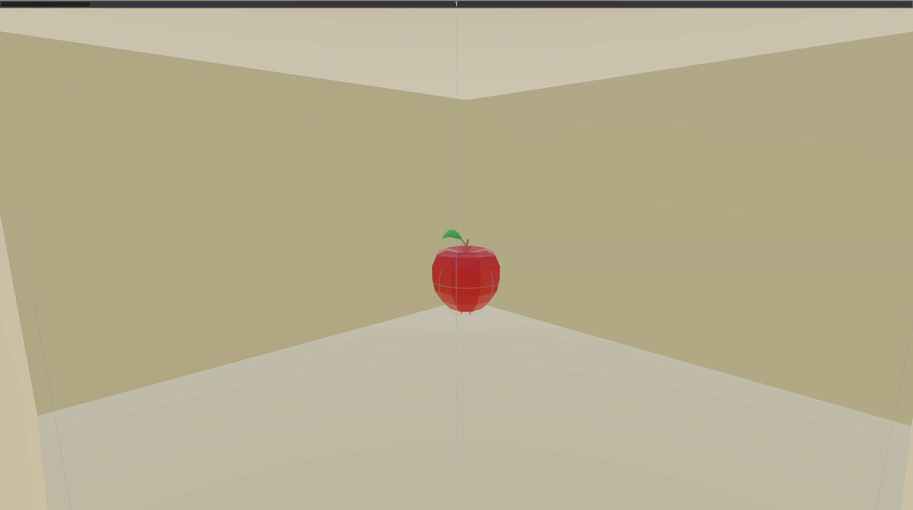

# Extending Avalon: Adding a new task
Our goal for Avalon was to build a robust generalization benchmark for RL. Although we've released it with a fixed set of 20 tasks, the underlying framework allows you to extend it to add more worlds, new tasks, or even different game mechanics altogether. This tutorial will describe how to add a new task to the Avalon environment.

## Introduction
### Motivation
As we make progress towards the existing benchmark tasks, new and different kinds of tasks will be needed to further gauge the extent of agent capabilities. The original 20 tasks were picked as basic skills that were reflective of the environment in which humans evolved, but the current benchmark is obviously far from exhaustive! We could extend the benchmark to include finer-grain motor tasks like object manipulation, tasks that involve more complex reasoning, or even tasks that involve multi-agent dynamics and theory of mind.

### Scope
Avalon comes with a wrapper around Godot, a 3D game engine, so in theory, you could implement any kind of environment that can be implemented in Godot. For the sake of this tutorial, we'll keep things simple and simply add a new task while making use of the existing island-like environment generator and game mechanics.

### Prerequisites
To follow this tutorial in full, you'll want to:
1. clone this repo locally
2. install the dependencies locally or get it running in Docker (see the main README)
3. download our copy of Godot (see the main README) in order to debug levels visually and locally

This tutorial assumes you're on Ubuntu, but Godot runs on all major operating systems (including OSX and Windows)

## The task
We will be implementing a simplified version of the `use_object_knock_down` task from the **dm-hard-eight** suite. In their [paper](https://arxiv.org/abs/1909.01387), this is referred to as **Baseball**. In its full incarnation, the task requires 7 high-level steps to complete the level, which are summarised in this image from the paper:


This task is situated indoors and features an apple and some tools, which are things we already have in Avalon, so this shouldn't be too tricky!

To keep the scope of this tutorial manageable, we will simplify the task slightly, and place the apple directly on the plinth - there will be no sensor or door to open. To spare us altering too much of the game mechanics, we will also require the apple to be eaten (grabbed and placed into the agent's head). A successful sequence of actions to complete the Baseball task thus becomes:
1. Find bat
2. Pick up bat
3. Hit apple off plinth
4. Eat apple

## The plan
To implement a new task in the Avalon environment, you'll want to familiarize yourself with the codebase and how things are laid out. The key things to know are:
 - `datagen/world_creation/` contains all the code to generate the environment and its tasks. The environment and task representations are all in Python, up until they are exported to Godot to be played.
 - `datagen/world_creation/godot` contains code specific to the Godot-side of Avalon. This involves physics, game mechanics and any non-PCG assets such as tools or animals. For this tutorial, we won't actually need to touch any of it.
 - `datagen/world_creation/tasks` contains task generators for all the existing tasks, including the one we're about to make. It's worth perusing some of them to get a sense of how the current tasks are generated.

We'll split building the task into six parts:
1. **Generating an existing task**: just getting something that exists to run
2. **Generating an empty world**: making an empty room with an apple
3. **Adding a plinth for food**
4. **Adding a bat**
5. **Adding diversity and difficulty**
6. **Wrapping up** (optional): final touches for easier use and for sharing with others


## Adding a new task

### 1. Generating an existing task
Before we get cracking on the new task, let's see if we can generate a world with one of the existing tasks.

To do that, we need a way to actually test the worlds that we're building. Godot can be a bit fiddly when you edit files underneath it while the editor is running, 
so we find it best to copy the `godot` subdirectory to a new location:
`rsync -r ./standalone/avalon/datagen/godot/ /tmp/baseball --info=progress2`

The contents of that subdirectory have everything to play the world directly in Godot on your machine. It's also where we'll generate all our worlds. Remember - if you do change something in the `godot` subdirectory that you want to keep, you'll need to sync it over again.

Here's a simple script to generate a world with a specified task, seed and difficulty:
```python
# generate.py - you can place this file in the root of the avalon folder for now.
from pathlib import Path  
  
import numpy as np  
  
from datagen.world_creation.configs.export import get_mouse_and_keyboard_export_config  
from datagen.world_creation.constants import AvalonTask  
from datagen.world_creation.world_generator import _GENERATION_FUNCTION_BY_TASK  
  
  
def create(output_path, task, difficulty, seed):  
    rand = np.random.default_rng(seed)  
    generation_function = _GENERATION_FUNCTION_BY_TASK[task]  
    generation_function(rand, difficulty, output_path, export_config=get_mouse_and_keyboard_export_config())  
  
  
if __name__ == "__main__":  
    create(Path("/tmp/taskgen/"), AvalonTask.EAT, 0.5, 12345)
```

If you run that script, you should end up with three new `.tscn` files in `/tmp/baseball` - these are the files that contain Godot scenes that encapsulate Avalon worlds.

Now open Godot and select the `godot.project` from `/tmp/taskgen`. If you open `main.tscn`, You can pan around the generated world and then hit Play (F5) at the top right to actually play it. You should see a world like the picture below and be able to move around the small island to eat the apple nearby. The controls are as follows:
```
WASD: move
G: grab
C: toggle mouse-capture to look around
mouse move: look around
mouse scroll: move active hand back and forth
SPACE: jump
TAB: crouch
ESC: exit
```


### 2. Generating an empty world
Let's move on to creating our own world. Before we start on replicating the Baseball task, let's create a simple indoor world with a single room and an apple--kind of like an `eat` task, but indoors.

To start us off, we'll take the generator file for a similar task such as `stack` (`datagen/world_creation/tasks/stack.py`). This task has an indoor version which is similar to what we want for our `baseball` task: a single room with an island with food on top. 

Let's strip out the implementations from `stack.py` and leave just the class and function skeletons - you should end up with something like `baseball.template.py` in the tutorial directory. 

There are only two key things in this template: the task config and the task generator. For now, let's leave the config, and make a minimal generator:
1. `get_site_radius` can return a constant for now - let's say 25.
2. `get_building_config` should return a single-story single-room building, which can be accomplished by this BuildingConfig:
```python
BuildingConfig(  
    width=16, # any size within that fits within the radius will do
    length=16,
    story_count=1,
    footprint_builder=RectangleFootprintBuilder(),  # rectangle is simplest
    room_builder=HouseLikeRoomBuilder(max_rooms=1),
    hallway_builder=DefaultHallwayBuilder(), # our building won't have hallways, so any hallway builder will do
    aesthetics=aesthetics,
)
```
3. `get_principal_obstacle_params` can be left as-is and return an empty tuple for now.
4. `add_principal_obstacles` is a bit more involved: we need to return an `IndoorTaskParams` tuple, which consists of a building, a list of entities, a spawn and a target location (in building space) and a tuple of valid entrance sites (in case this building is placed in an outdoor world).

    For now, we'll place both spawn and target in the corners of the room, spawn no extra items, and permit an entrance on all sides of the first-story room. Our `add_principal_obstacles` should now look like this:

```python
def add_principal_obstacles(  
    self, rand: np.random.Generator, building: Building, obstacle_params: Tuple  
) -> IndoorTaskParams:
    extra_entities = []
    spawn_location = np.array([1.5, 1.5, 1.5])  # x, y, z
    # 1.5 = wall width + half a tile's size
    target_location = np.array([building.width - 1.5, 1.5, building.length - 1.5])  
    valid_entrance_sites = ((0, 0, tuple(Azimuth)),)  # 0th floor, room_id=0, all directions permitted
    return building, extra_entities, spawn_location, target_location, valid_entrance_sites
```

Before we call our generation script, we need to "register" our new task and task generation function:
 - Add a new task to the `AvalonTask` enum in `datagen/world_creation/constants.py` (`BASEBALL = "BASEBALL"`)
 - Add it to the task-to-generator mapping in `datagen/world_creation/world_generator.py` (`AvalonTask.BASEBALL: generate_baseball_task`)

With that in place, you should be able to run our `generate.py` with our task like so:
`create(Path("/tmp/taskgen/"), AvalonTask.BASEBALL, 0.5, 12345)` and get an empty room with an apple that looks something like this (remember to press C and move the mouse around):



### 3. Adding a plinth for food
Now that we have a room, let's try making a plinth for the apple (remember, we're skipping the ball part and placing the target food straight on the pedestal).

Stack and other tasks have similar elevated constructions, so we can re-use that logic and alter the room floor height map to have an elevated tile somewhere in the room. Add this to the start of `add_principal_obstacles`:

```python
story = only(building.stories)  
room = only(story.rooms)  
plinth_size = 1
plinth_height = 5
plinth_tile = BuildingTile(room.width // 2, room.length // 2)
updated_room, island_tiles = add_food_island(room, plinth_tile, plinth_size, plinth_height) 
story.rooms[0] = updated_room
room = updated_room  # make sure we use the updated room for any code below!
```

If you now run the world, you should see a tall pillar in the middle of the room. Conveniently, `add_food_island` has also adjusted room height so the pillar doesn't run through the ceiling.


The apple is still lying to the side, so let's place it on top of our plinth. To do that, we simply need to update the `target_location`, which determines where the food is placed:
```python
# To go from tile to a position, we can use the handy BuildingTaskGenerator._position_from_tile function:
room_position_3d = np.array([room.position.x, 0, room.position.z])
target_location_in_room_space = self._position_from_tile(room, plinth_tile, at_height=FOOD_HOVER_DIST)
target_location = local_to_global_coords(target_location_in_room_space, room_position_3d)
)
```

We can also map the spawn location to a tile to keep things consistent:
```python
spawn_tile = BuildingTile(1, 1)
spawn_location_in_room_space = self._position_from_tile(room, spawn_tile, at_height=AGENT_HEIGHT / 2)
spawn_location = local_to_global_coords(spawn_location_in_room_space, room_position_3d)
```

> NOTE: notice the `local_to_global_coords` call - the `island_tiles` are returned in room space, whereas our building task generator should output the spawn/target locations in *building* space, so we need to transform it. In general, if any positions seem off when building worlds, it's worth double-checking you're always in the right coordinate space.

If you run the world now, the apple should be on the plinth - too high for us to grab it, even with jumping.


### 4. Adding a bat
To make the world solvable again, let's add a bat. In our task generation context, this means adding an entity to the currently-empty list returned by `add_principal_obstacles`. Avalon already has some useful tools we could use as a makeshift bat - such as a `LargeStick` (see `datagen/world_creation/entities/tools/weapons.py`). Update `extra_entities = []` to this:

```python
bat_tile = BuildingTile(4, 4)
bat_thickness = 0.5
bat_position_in_room = self._position_from_tile(room, bat_tile, at_height=bat_thickness / 2)
bat_position = local_to_global_coords(bat_position_in_room, room_position_3d)
extra_entities = [LargeStick(position=bat_position)]
```


Now the world is solvable. Wouldn't quite call it baseball, but we can definitely poke the apple off its plinth and eat the apple!

### 5. Adding diversity and difficulty
Diversity and varied task difficulty are important for training generalist agents. Currently, our world will always look the same, regardless of difficulty and seed, so let's fix that.

This is where `get_principal_obstacle_params` comes in - we can express the `(difficulty, seed) -> parameter` mapping in this function. Let's consider what would make our task more or less difficult, and what kind of variety we can add to it. This is ultimately up to you, but here are some things we could vary:
 1. plinth location
 2. bat location (further from player and plinth is harder)
 3. spawn location (further from plinth is harder)
 4. plinth height (higher should be harder)
 5. bat size/form factor (longer is probably easier)
 6. bat weight (hard to poke the apple with a very light stick)

For this tutorial, we'll stick to the first four, though you can find examples of changing entity size and weight in other tasks (e.g. `stack` and `push`). As a starting point, we can move our hard-coded values up to `get_principal_obstacle_params` and extract them out in `add_principal_obstacles`:

```python
def get_principal_obstacle_params(...) -> Tuple:  
    story = only(building.stories)  
    room = only(story.rooms)  
  
    plinth_height = 5  
    plinth_tile = BuildingTile(room.width // 2, room.length // 2)  
    bat_tile = BuildingTile(4, 4)  
    spawn_tile = BuildingTile(1, 1)  
    return plinth_height, plinth_tile, bat_tile, spawn_tile

def add_principal_obstacles(...) -> IndoorTaskParams:  
    plinth_height, plinth_tile, bat_tile, spawn_tile = obstacle_params
    ...
```

For indoor tasks, it makes sense to think of placement in terms of tiles, since that discretizes the world space in a convenient way. The hardest we can make our task in terms of placing things is to have the bat be as far as possible from the plinth, and then have the player spawn as far as possible from the bat - so let's start with finding the plinth tile, then deciding the bat tile, and finally the spawn. We will invoke the random generator for the placement to make sure worlds vary across seeds.

```python
plinth_height = 5
plinth_tile = tuple(rand.choice(room.get_tile_positions()))
# The 'bat' is slightly larger than a tile, so we avoid spawning on the room edge so it doesn't clip into walls
viable_bat_tiles = list(product(range(1, room.width - 1), range(1, room.length - 1)))  
viable_bat_tiles = [tile for tile in viable_bat_tiles if tile != plinth_tile]  

# The decide_tiles_by_distance assigns a probability to all viable tiles depending on their distance from the target tile (here: plinth)
bat_tile = only(decide_tiles_by_distance(viable_bat_tiles, plinth_tile, difficulty, rand))
viable_spawn_tiles = [tile for tile in viable_bat_tiles if tile != bat_tile]  
spawn_tile = only(decide_tiles_by_distance(viable_spawn_tiles, bat_tile, difficulty, rand))
# We convert our tile tuples into BuildingTiles as that's what we were using before
return plinth_height, BuildingTile(*plinth_tile), BuildingTile(*bat_tile), BuildingTile(*spawn_tile)
```

Finally, we can also add some difficulty variation to the plinth height. You can import the referenced constants from `datagen/world_creation/constants.py`.
```python
# When possible, it's best to derive these kinds of values from existing constants so you can adjust other game parameters without having to change the tasks
# Note that we add the floor thickness to the plint height, as the rest of the room also has an implied height (1 by default)
plinth_height = MAX_JUMP_HEIGHT_METERS + STANDING_REACH_HEIGHT + DEFAULT_FLOOR_THICKNESS + 0.1  # just a bit higher than reachable by hand
max_plinth_height = 7.9  # determined empirically, requiring jumping
plinth_height_std_dev = 0.2  # this controls how "loose" is the difficulty distribution - higher means more variety for the same difficulty

# The final plinth height is determined by sampling from a Normal distribution fit to the appropriate range between min/max plinth heights, based on difficulty
plinth_height = normal_distrib_range(  
    min_plinth_height, max_plinth_height, plinth_height_std_dev, rand, difficulty  
)
```

You can now play the world and tweak the difficulty parameter and verify that the difficulty ramps up correctly - see examples of what the world should look like with the seed `12345` and difficulties `0, 0.5, 1.0`. The gimbal indicates the spawn point. As you can see, the pillar height and total distance required scales with difficulty.


You might want to tune parameters to ensure 0 feels easy enough and that 1 feels hard, and that difficulty ramps up gradually. Our rule of thumb is that 0 should be easy enough to sometimes solve via random actions, and 1 to be hard enough for players to solve only with significant effort.

#### Impossible worlds
When making world generators, you should be mindful of what edge cases can arise. In general, it is expected that some random seeds may yield world configurations that are impossible to generate or impossible to solve. However, to keep world generation and the overall environment fast, you want to avoid this as much as possible. However, if such cases may arise in your world generation code, you should check for them and throw an `ImpossibleWorldError` if they occur. In our baseball task, there should be no such cases.

### 6. Wrapping up
There are a few (optional) things to do before calling this done:
 - Extracting out hard-coded values to the `BaseballIndoorTaskConfig` so they can be altered without changing code
 - Coming up with a sensible value for the site radius, and mapping it to difficulty (a large room is harder than a small one)
 - Deriving building width/length from the site radius, so this task can be used for compositional outdoor tasks

If you wish to integrate this task into existing compositional tasks (`survive`, `find`, etc.), you'll also need to "register" it as a building task with the following additions:
 - Adding to the `BuildingTask` enum in `datagen/world_creation/indoor/building.py`
 - Adding to the building task generator mapping (`get_building_task_generator_class`) and obstacle config dict (`INDOOR_OBSTACLE_CONFIG_DICT`) in `datagen/world_creation/worlds/compositional.py`

---

With all that in place - we have a simplified version of dm-hard-eight's Baseball task! The complete task-generator code can be found in `baseball.py`.
