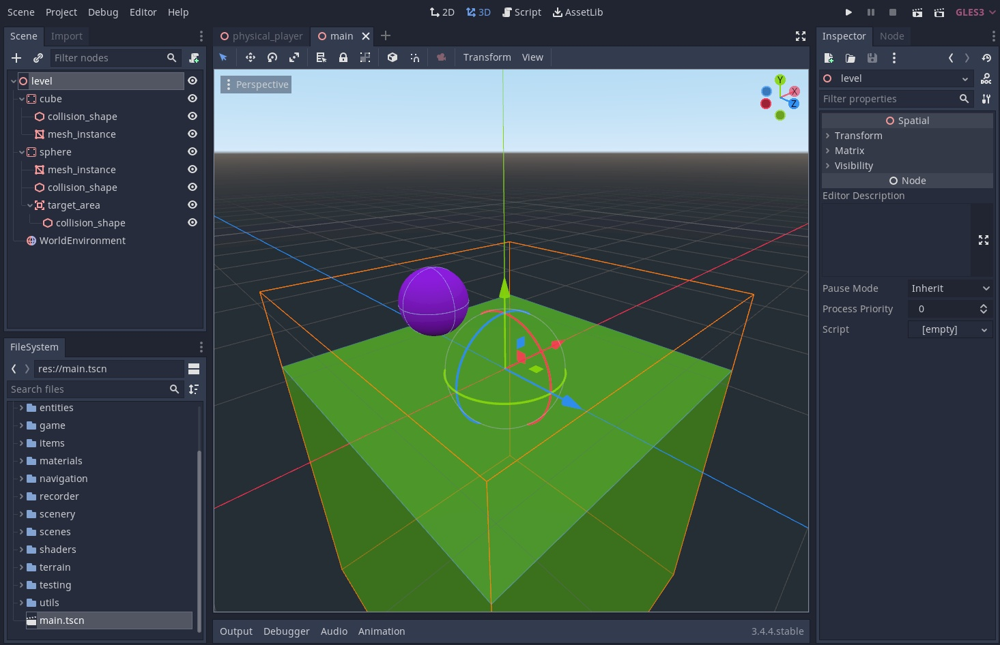
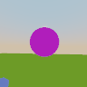
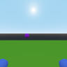

# Building on top of Avalon: Creating a custom RL environment
The Avalon benchmark runs of top of Godot, an open-source 3D game engine. In order for Avalon to be extensible in a variety ways, the Godot engine wrapper is separate from the Avalon-specific logic, which means you can use it to turn your own Godot game into a gym-like RL environment. This tutorial will describe how to do just that.

## Introduction
### Motivation

There's no shortage of real-world problems that could be approached using reinforcement learning, but they are often limited by having a fast, accurate simulator. 3D engines tend to have steep learning curves and can be tricky to integrate with a Python API. We've found Godot to strike a good balance between speed and feature-richness while being highly portable. With a lean Python wrapper it lends itself well as a simulator, be it for games or real-world applications. 

Our GodotEnv is similar in spirit to [Godot RL Agents](https://github.com/edbeeching/godot_rl_agents), but provides more flexibility for bridging Python and Godot, and is optimized for performance (7000 SPS, see [benchmarks](../../avalon/datagen/godot/benchmark)). Additionally, we provide tooling to work specifically with embodied agents, including handling VR headsets, and collecting human gameplay data. 

### Scope
For this tutorial, we'll keep things very simple. We'll create a playable world in Godot, leveraging physics and controls from Avalon, add in a termination condition, and then create a Gym environment to allow agents to play it. We'll also keep the action and state spaces the same as for Avalon (see `AvalonObservation` and `VRAction`).

### Prerequisites
This tutorial assumes basic knowledge of:
 - **Godot, namely its editor and basics of GDScript**. If you're new to Godot, you might want to skim [Introduction to Godot](https://docs.godotengine.org/en/stable/getting_started/introduction/index.html#toc-learn-introduction).
 - **Type hinting in Python.** Avalon code as well as this tutorial makes use of type hints, including generics, which may look intimidating upon first look. If you're not familiar with typing in Python, it's worth reading this [primer](https://realpython.com/python-type-checking/), and if you haven't used generics before, have a look at [mypy's docs on generics](https://mypy.readthedocs.io/en/stable/generics.html).

Once you're good to go, make sure you have Avalon and Godot running locally:
1. clone this repo
2. install the dependencies locally or get it running in Docker (see the main README)
3. download our copy of Godot (see the main README)

This tutorial assumes you're on Ubuntu, but you should be able to complete this tutorial on macOS as well. If you're on Windows, you can still build and play-test your environment (Step 1) directly in the Godot editor, but you'll need to use Docker to follow the rest of the tutorial.

## SphereEaterEnv
For this tutorial, we'll create our own 3D environment on top of GodotEnv, just like AvalonEnv. We'll be building a very simple environment called **SphereEaterEnv**. The concept is as follows: the agent is placed on top of a large cube, and its goal is to make its way to a single sphere somewhere in the level. We'll keep the physics and game mechanics the same as for Avalon, but we'll point you to where you could change them if you so like. The environment will be deterministic and static - effectively a very simple, hardcoded game. If you're looking to build a custom procedurally generated environment, you might want to start with the [baseball tutorial](../tutorial_add_task/README.md) instead.

## The plan
We'll split making this tutorial into six parts:
1. **Making the Godot level**: getting something playable just in Godot
2. **Running the stock GodotEnv**: let's see what the interface looks like without Avalon
3. **Making our Gym environment**: tying the Godot and Python sides together
4. **Adding a goal evaluator**: making our env beatable
5. **Making a simple agent**: making something that solves the environment to test it
6. **Making the environment more fun**: (optional) an example of how to make our environment more dynamic

## Making SphereEaterEnv
### 1. Making the Godot level
To start off, we'll stay exclusively in Godot-land. Let's create the world that the agent will eventually play in! 

Godot can be a bit fiddly when you edit files underneath it while the editor is running, so we find it best to copy the `avalon/godot` subdirectory to a new location:
`rsync -r ./avalon/datagen/godot/ /tmp/sphere_eater --info=progress2`

Open up the Godot editor, hit import and point it to `/tmp/sphere_eater/project.godot` or whichever directory you're working in. Now hit Scene -> New Scene, and create a 3D scene. At this point, you can design the world entirely as you like, bearing in mind the following restrictions:
 - Your main scene needs a `WorldEnvironment` node called "WorldEnvironment". This node dictates the overall environment behavior (lighting, background, rendering settings). Make sure that you actually set its `Environment` parameter.
 - By default, the player will spawn at (0,0,0), facing the negative-Z direction, so make sure there's no obstacles located there, and that there is a "floor" underneath (any StaticBody with some thickness and a collision shape will do).
 - All StaticBodies and RigidBodies should have a collision shape, as Godot can exhibit undefined behavior when this is not the case. If you don't actually want an object to be subject to collision, you can add any collision shape and set it to be disabled.

For our SphereEater env, we made a large green cube for the floor, and a purple sphere as the sphere to be eaten. It looks like this:


If you want to skip building your own env and just use ours, you can use the `main.tscn` in this folder. *Note that .tscn files are human-readable, so if you're building up the file from scratch, you can run a plain-text diff between the bundled file and yours to see any differences in case something is not working.*

You can now hit the "Play" button on the top right of the editor (or hit F5), and you should be able to play the level, using WASD for controls, mouse to look around and space to jump.

### 2. Running the stock GodotEnv
Now that we have the Godot side of the environment, let's get it running with Gym. To start off, let's try running the stock GodotEnv in the same way as you would with AvalonEnv in [this notebook](../../notebooks/gym_interface_example.sync.ipynb):

```python
from avalon.agent.godot.godot_gym import create_base_benchmark_config
from avalon.datagen.env_helper import display_video
from avalon.datagen.godot_env.actions import VRAction
from avalon.datagen.godot_env.goals import NullGoalEvaluator
from avalon.datagen.godot_env.godot_env import GodotEnv
from avalon.datagen.godot_env.observations import AvalonObservation

env = GodotEnv(
    config=create_base_benchmark_config(),
    observation_type=AvalonObservation,
    action_type=VRAction,
    goal_evaluator=NullGoalEvaluator()
)
env.reset()


def random_env_step():
    action = env.action_space.sample()
    obs, reward, done, info = env.step(action)
    if done:
        env.reset()
    return obs


observations = [random_env_step() for _ in range(50)]
display_video(observations)
```

As you can see, GodotEnv takes four key parameters, which collectively define the way your environment will behave:
 - `config` - a sim spec that defines how the "player" behaves in Godot, as well as how data is recorded
 - `observation_type` - the type that defines what features of the environment are available to the agent 
 - `action_type` - the type that encodes what actions the agent can take in the environment (action space)
 - `goal_evaluator` - a `GoalEvaluator` instance that holds logic for dishing out reward and deciding whether an episode is complete

*Note that `observation_type` is a super-set of the agent's state space, and should include all the data you want to pipe over from Godot, including variables used for reward, episode termination, debugging, etc. You can further refine the active feature list, as well as the list of features exposed to the agent by overriding `get_selected_features` and `get_exposed_features`.*

For this tutorial, we'll keep the `config` (SimSpec) as well as the `action_type` the same as it is for AvalonEnv, since we want to keep the physics, game mechanics and frame retrieval the same. If you want to change any of these aspects, you'll need to create new ones, or extend the existing ones.

Now if you run the code snipped above in a notebook, you should see a black square. This is expected, since the default world generated by GodotEnv is completely empty and has no light. Now let's get our Godot level showing up on the gym side.

### 3. Making our Gym environment

In general, GodotEnv is fairly close to what we want already - it takes care of piping state/actions between Godot and Python, handles seeding and resetting, and lets us replay an agent's trajectory. We want to keep all of that, so our env class can simply extend GodotEnv. In order for the env to load our level instead of the dark void we saw before, we only need to override the `_create_world_generator` function to return a `WorldGenerator` that "generates" the level we made before. For that we'll also have to create a new `WorldGenerator` class. Since our world is completely static, we can simply copy it over to the passed output directory. Altogether that looks something like this:  

```python
import attr
import shutil

from pathlib import Path
from typing import List
from typing import Optional

from avalon.datagen.godot_env.godot_env import GodotEnv
from avalon.datagen.world_creation.world_generator import GeneratedWorldParams
from avalon.datagen.world_creation.world_generator import WorldGenerator

@attr.s(auto_attribs=True, hash=True, collect_by_mro=True)
class SphereEaterWorldParams(GeneratedWorldParams):
    """
    The `GenerateWorldParams` and `GeneratedWorldParams` classes are used for inputs and outputs useful in context of
    world generation. Since we have a single world with no dynamic generation, we'll leave this empty for now.   
    """
    pass


class SphereEaterWorldGenerator(WorldGenerator[SphereEaterWorldParams]):
    def __init__(self, base_path: Path, seed: int):
        super().__init__(base_path, seed)
        # Make sure to update the path below if you're not using the bundled example world
        shutil.copyfile(Path("docs/tutorial_custom_env/main.tscn"), self.output_path / "main.tscn")
        
    def generate_batch(self, start_world_id: Optional[int], batch_size: int = 1) -> List[SphereEaterWorldParams]:
        # If your worlds involve any sort of dynamic generation / files being written, you'll want to generate each
        # level into its own directory rather than returning the same one for all of them.
        return batch_size * [SphereEaterWorldParams(self.output_path)]


class SphereEaterEnv(GodotEnv):
    def _create_world_generator(self) -> WorldGenerator:
        return SphereEaterWorldGenerator(base_path=Path("/tmp/level_gen"), seed=0)
```

If we now substitute `GodotEnv` with `SphereEaterEnv` in the previous snippet, we should see the agent wobbling about in our world. This is example output for the bundled main.tscn:



Though no matter how intelligent the agent would be, the environment is unbeatable right now, as there is no termination condition, so let's set up our own `GoalEvaluator`.

### 4. Adding a goal evaluator
#### The Godot side
To allow for easier reward shaping and more flexibility in general, the final say over reward and episode termination logic is handled on the Python side. It can however only use what's exposed in the observations to make that decision, so logic concerning interactions of entities in the Godot world should live on the Godot side.

Our environment is about "eating" spheres, so we need something in the observations to tell us whether a sphere has been eaten. We'll make the eating mechanism as simple as possible (and the same as it is in Avalon) - if the agent's head is intersecting the sphere, the sphere has been eaten. Let's start by adding this on the Godot side and play-testing if it works.

We can add our logic to `ObservationHandler` (`datagen/godot/game/utils/observation_handler.gd`), which houses similar logic to what we want. Let's add a function like this:

```gdscript
func is_sphere_eaten(player: Player) -> bool:
	# 1. We find the sphere Area object in our world tree (take a look at main.tscn if this doesn't make sense)
	var _tree = root.get_tree()
	var sphere_area = root.find_node("target_area", true, false)
	if sphere_area == null:
		# This should never happen as long as we call this function after a level has been loaded, but it will be handy
		# for debugging. 
		return false
	# 2. Then we find the "eat area" that's present on the player. Open up `datagen/godot/game/player/scenes/physical_player.tscn`
	# in the editor to see what other nodes there are if you're looking for something else. You can add and script extra
	# attributes of the agent there as well.
	var head = player.get_node("physical_player/physical_head/eat_area")
	# 3. ...and check if they intersect!
	return sphere_area.overlaps_area(head)
```

To see if that works, let's add a debug print to `advance_frame` in GameManager (`datagen/godot/game/game_manager/game_manager.gd`):
```gdscript
func advance_frame() -> void:
	frame += 1
	set_time_and_seed()
	print("is sphere reached? %s" % observation_handler.is_sphere_reached(player))
```

*Remember to sync your code over to the working directory (`/tmp/sphere_eater`) if you're not editing it directly!*

If you hit play now and make your way to the sphere, you should see the Godot logs change from False to True. Note that Godot runs with a debugger by default when in-game, so you can set breakpoints in code even after running it to inspect values, look at the entity tree, etc. This is especially useful if you hit errors about nil instances (which usually indicate an entity being located elsewhere in the tree than you expected).

Once you have your episode completion logic working (or the right ingredients for it being measured correctly), we can expose it in the observations sent over to the Python side. In our case, we just need one line in `ObservationHandler.get_current_observation`:

```gdscript
func get_current_observation(player: Player, frame: int) -> Dictionary:
    ...
    observation["is_sphere_eaten"] = int(is_sphere_eaten(player))  # bools should be returned as ints
    ...
    return observation
```

You can also adjust the `is_done` logic if you like, but you can also simply override it on the Python side later.

#### The Python side

Now we're ready to implement the reward and episode termination logic. This is as simple as extending `GoalEvaluator` and implementing its abstract methods. We'll assign a sparse 0/1 reward when the sphere is eaten, and we'll limit the episode to a set number of frames (to avoid episodes running indefinitely).

```python
from avalon.datagen.godot_env.goals import GoalEvaluator
from avalon.datagen.godot_env.goals import GoalProgressResult
from avalon.datagen.godot_env.goals import ObsType
from avalon.datagen.godot_env.observations import AvalonObservation

@attr.s(auto_attribs=True, hash=True, collect_by_mro=True)
class SphereEaterObservation(AvalonObservation):
    is_sphere_eaten: bool = False

class SphereEaterGoalEvaluator(GoalEvaluator[SphereEaterObservation, SphereEaterWorldParams]):
    MAX_FRAMES = 500

    def calculate_goal_progress(self, observation: SphereEaterObservation) -> GoalProgressResult:
        is_done = observation.is_sphere_eaten or observation.frame_id.item() >= self.MAX_FRAMES 
        return GoalProgressResult(reward=1 if observation.is_sphere_eaten else 0, is_done=is_done, log={})

    def reset(self, observation: ObsType, world_params: Optional[SphereEaterWorldParams] = None) -> None:
        pass  # add logic here if your evaluator is stateful
```

Time to test if this works. It might take a while for a random agent to get to the purple sphere, so let's try making something slightly more sophisticated.

### 5. Making a simple agent
The agent spawns facing the sphere, so all it takes to look smart here is to march straight forward:

```python
import attr
from avalon.datagen.env_helper import get_null_vr_action

base_action = get_null_vr_action()
move_forward = attr.evolve(base_action, head_z=-1)

steps = 25
actions = [move_forward] * steps
observations = []
for step in range(steps):
    obs, goal_progress = env.act(actions[step])
    if goal_progress.is_done:
        print("Done!")
        env.reset()
        break
    observations.append(obs)
display_video(observations)
```

If all is well, we should see the log say "Done!" and the video terminating right as the agent's head collides with the sphere:


You can double-check this by removing the `if goal_progress.is_done` statement - you should see the agent go straight through the sphere instead (as the sphere's collision shape is disabled).

---

With all this place, we have a simple Godot game with an embodied agent ready to be trained, exposed via the gym interface! For an example of how to make the environment more dynamic and interesting, see the optional step below.

### 6. Making the environment more fun (optional)
As a final step, let's look at how you might script the Godot side to make the environment more dynamic. We'll add some basic logic to our sphere to make it move away from the player depending on its location.

Let's do the following:
 - Change the sphere to be a KinematicBody (in editor, right-click the StaticBody node, select "Change type")
 - Add some bounding walls to the world, so you can't fall off
 - Make the sphere smaller and enable its collision shape, so it doesn't move out of bounds (but keep the target area slightly larger than the collision shape so the termination condition still works)
 - Add some logic for the sphere to move away from the player using the script below

You can save the script somewhere in the `godot/game` directory and set it on the sphere in the Inspector tab in the editor.

```gdscript
# sphere.gd
extends KinematicBody

var _player
const MAX_SPEED = 2.5

func get_player_position() -> Vector3:
	if _player == null:
		_player = get_tree().root.find_node("player", true, false)
	return _player.physical_body.global_transform.origin


func _physics_process(_delta):
	var away_from_player = -global_transform.origin.direction_to(get_player_position()) * MAX_SPEED
	away_from_player.y = 0
	away_from_player.z += randf() * 0.5
	away_from_player.x += randf() * 0.5
	var _velocity = .move_and_slide(away_from_player)
```

At this point the environment is a bit more dynamic, and our simple hard-coded agent is not able to solve it:



That's it! The final product can be found in `main_final.tscn`.
